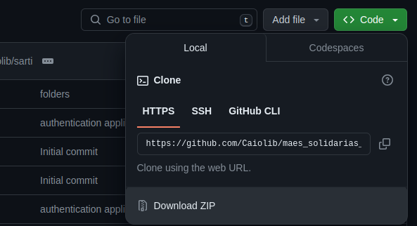
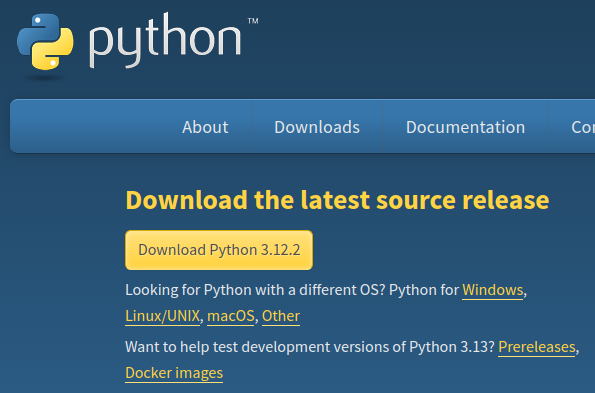

# Projeto Mães Solidárias
Integrantes: Caio Liberal, João Sarti e Luigi Lopes - Bacharelado em Ciência da Computação Insper (IBCC).

## Técnologias utilizadas
Devido ao breve tempo de produção, para o desenvolvimento do projeto optamos por utilizar technologias com que todos os integrantes estivessem acostumados. Partindo desse principio, concluimos que Python era a melhor linguagem para se utilizar, onde dentro desta decisão optamos por utilizar Django como nosso framework para Backend e Flask para frontend, alem de utilizarmos SQLite para nosso armazenamento. Todas as bibliotecas necessarias para a execução do projeto estão em seus respectivos requirements.txt.

### O Django
Sendo abordado no primeiro semestre de Ciência da Computação durante a Sprint Session, e sendo o maior framework sincrono para APIs em python, Django foi nossa primeira escolha, praticamente imediata. Por ja vir com varias features de segurança, autenticação, modelagem de banco de dados e mais, ele pouparia muito trabalho necessario com outras aplicações como Flask, o que seria necessario em uma sprint curta de uma semana. Alem de nos proporcionar uma grande escalabilidade, caso necessario.

### O Flask
Para nosso frontend resolvemos utilizar o framework Flask, uma escolha não muito comum, mas decidimos utilizar a interface visual Jinja para nosso HTML e CSS, onde o flask nos oferecia uma possibilidade leve de utilizar tal ferramenta, por ser um framework que traz poucas construções em seu Build inicial, mantendo o front-end leve, alem de nos fornecer boas ferramentas para manipular cookies e requisições.

### O SQLite
Resolvemos utilizar o SQLite por ser mais agil, como o banco de dados nativo do Django. Porem para casos de maior escalabilidade, o Django é compativel com qualquer Database sequencial(que siga a plataforma SQL), assim podendo suportar com poucas mudanças bancos como Oracle ou Postgre para grandes aplicações.

## Como executar o projeto
Para executar o projeto, é necessario baixar o Zip dos códigos dos repositório do Github:

```https://github.com/joaopgs4/maes_solidarias_back``` e ```https://github.com/Caiolib/maes_solidarias_front```



Após ter os Zips baixados, é necessario tambem ter o Python 3 instalado em sua maquina. O download pode ser realizado no site do python:
```https://www.python.org/```

Alem disso é necessario baixar todas as biblioteca utilizadas, presentes nos arquivos readme.txt. Para isso use o comando no terminal:
pip install -r requirements.txt



Por fim, é necessario executar pelo terminal os arquivos root dos programas (python3 manage.py runserver e python3 app.py).

## Estudo de código
O cógio do front-end esta bem simples e intuitivo, então não ha muito o que explicar que não esteja ja comentado ou intuitivo. Por tanto, focaremos no estudo de código do backend.

### APPs
A organização do Django é feita em APPs dedicados para cada funcionalidade da API a ser implementada, para tanto utilizamos 3 APPs no projeto:
* Access, responsavel por organizar a criação, autenticação e manipulação de usuarios.
* Store, responsavel por organizar e manipular objetos e categorias da loja.
* Events, responsavel por salvar Eventos realizados pela equipe Mães Solitárias.

### Dentro dos APPs
Dentro dos apps apenas três arquivos foram editados e comentados (Em especial no APP Store). Estes são os os arquivos models.py, responsavel pela definição de classes(modelos) utilizados para a criação de objetos, views.py, que contem todas as funções dentro de cada rota e o urls.py, que define as rotas do projeto.

### Autenticação e Proteção
Para a proteção de dados do usuario na apliação, foi necessaria poucas mudanças, devidos aos mecanismos ja nativos do Django. Por exemplo temos os tokens de CSRF em todas as requisições POST e PUT. A unica ação de segurança necessaria foi a criação de tokens JWT para a autenticação de um usuario ja logado, para então dar a ele as autorizações respectivas para cada rota. A geração dos tokens e hash foi utilizado utilizando uma biblioteca externa.

### AVISO:
Importante lembrar de tirar o @csrf_except das funções antes de enviar o projeto para produção. Grande risco exposto, utilizamos apenas para facilitar o testing utilizando do Postman.